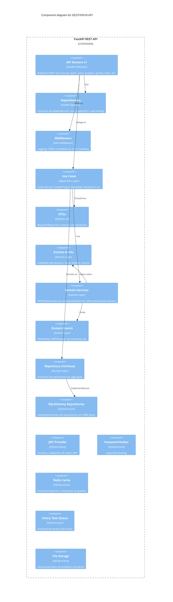

# C4 Component Diagram — GESTKRUN Backend (Nivel 3)

```mermaid
C4Component
  title Component diagram for GESTKRUN API

  Container_Boundary(api, "FastAPI REST API") {
    Component(routers, "API Routers v1", "FastAPI APIRouter", "Endpoints REST por recurso: auth, users, projects, sprints, tasks, etc.")
    Component(deps, "Dependencies", "FastAPI Depends", "Inyección de dependencias: auth, pagination, rate limiting")
    Component(middleware, "Middleware", "ASGI Middleware", "Logging, CORS, correlation-id, error handling")

    Component(use_cases, "Use Cases", "Application Layer", "Casos de uso: CreateProject, MoveTask, PlanSprint, etc.")
    Component(dtos, "DTOs", "Pydantic v2", "Request/Response schemas con validación")

    Component(entities, "Entities & VOs", "Domain Layer", "Entidades del dominio, Value Objects, Enums")
    Component(domain_services, "Domain Services", "Domain Layer", "WIPValidationService, KanbanFlowService, MetricsCalculationService")
    Component(domain_events, "Domain Events", "Domain Layer", "TaskMoved, WIPViolated, SprintClosed, etc.")
    Component(repo_interfaces, "Repository Interfaces", "Domain Layer", "Contratos de repositorio por aggregate")

    Component(persistence, "SQLAlchemy Repositories", "Infrastructure", "Implementaciones de repositorios con ORM async")
    Component(auth_provider, "JWT Provider", "Infrastructure", "Emisión y validación de tokens JWT")
    Component(password_hasher, "Password Hasher", "Infrastructure", "Argon2id hashing")
    Component(cache_provider, "Redis Cache", "Infrastructure", "Caché de sesiones y resultados de queries")
    Component(queue, "Celery Task Queue", "Infrastructure", "Encolado de tareas asíncronas")
    Component(storage, "File Storage", "Infrastructure", "Almacenamiento de artefactos (local/S3)")
  }

  Rel(routers, deps, "Usa")
  Rel(routers, middleware, "Pasa por")
  Rel(routers, use_cases, "Delega en")
  Rel(use_cases, dtos, "Transforma")
  Rel(use_cases, domain_services, "Usa")
  Rel(use_cases, repo_interfaces, "Persiste via")
  Rel(domain_services, entities, "Opera sobre")
  Rel(domain_services, domain_events, "Emite")
  Rel(repo_interfaces, persistence, "Implementado por")
```
