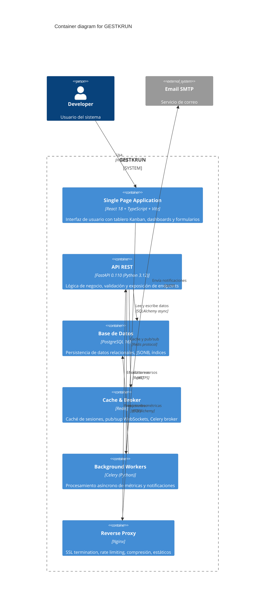

# C4 Container Diagram — GESTKRUN (Nivel 2)

```mermaid
C4Container
  title Container diagram for GESTKRUN

  Person(dev, "Developer", "Usuario del sistema")

  System_Boundary(gestkrun, "GESTKRUN") {
    Container(spa, "Single Page Application", "React 18 + TypeScript + Vite", "Interfaz de usuario con tablero Kanban, dashboards y formularios")
    Container(api, "API REST", "FastAPI 0.110 (Python 3.12)", "Lógica de negocio, validación y exposición de endpoints")
    Container(db, "Base de Datos", "PostgreSQL 16", "Persistencia de datos relacionales, JSONB, índices")
    Container(cache, "Cache & Broker", "Redis", "Caché de sesiones, pub/sup WebSockets, Celery broker")
    Container(worker, "Background Workers", "Celery (Python)", "Procesamiento asíncrono de métricas y notificaciones")
    Container(proxy, "Reverse Proxy", "Nginx", "SSL termination, rate limiting, compresión, estáticos")
  }

  System_Ext(email, "Email SMTP", "Servicio de correo")

  Rel(dev, spa, "Usa", "HTTPS")
  Rel(spa, proxy, "Solicita recursos", "HTTPS")
  Rel(proxy, api, "Proxy inverso", "HTTP")
  Rel(api, db, "Lee y escribe datos", "SQLAlchemy async")
  Rel(api, cache, "Cache y pub/sub", "Redis protocol")
  Rel(api, worker, "Encola tareas", "Redis")
  Rel(worker, db, "Lee/escribe métricas", "SQLAlchemy")
  Rel(worker, email, "Envía notificaciones", "SMTP")
```
