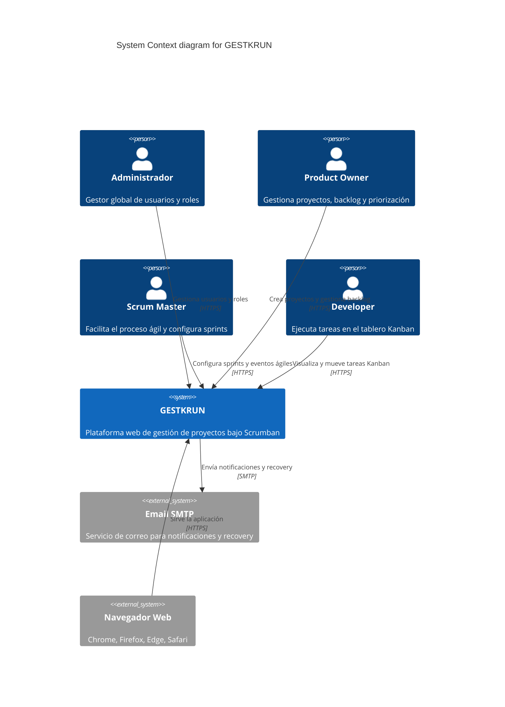

# C4 Context Diagram — GESTKRUN (Nivel 1)

```mermaid
C4Context
  title System Context diagram for GESTKRUN

  Person(admin, "Administrador", "Gestor global de usuarios y roles")
  Person(po, "Product Owner", "Gestiona proyectos, backlog y priorización")
  Person(sm, "Scrum Master", "Facilita el proceso ágil y configura sprints")
  Person(dev, "Developer", "Ejecuta tareas en el tablero Kanban")

  System(gestkrun, "GESTKRUN", "Plataforma web de gestión de proyectos bajo Scrumban")

  System_Ext(email, "Email SMTP", "Servicio de correo para notificaciones y recovery")
  System_Ext(browser, "Navegador Web", "Chrome, Firefox, Edge, Safari")

  Rel(admin, gestkrun, "Gestiona usuarios y roles", "HTTPS")
  Rel(po, gestkrun, "Crea proyectos y gestiona backlog", "HTTPS")
  Rel(sm, gestkrun, "Configura sprints y eventos ágiles", "HTTPS")
  Rel(dev, gestkrun, "Visualiza y mueve tareas Kanban", "HTTPS")
  Rel(gestkrun, email, "Envía notificaciones y recovery", "SMTP")
  Rel(browser, gestkrun, "Sirve la aplicación", "HTTPS")
```
