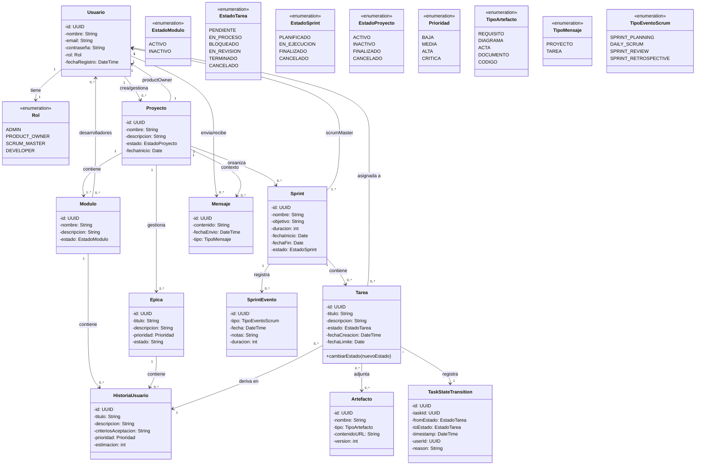

# Diagrama de Clases — GESTKRUN (corregido)

```mermaid
classDiagram
    class Usuario {
        -id: UUID
        -nombre: String
        -email: String
        -contraseña: String
        -rol: Rol
        -fechaRegistro: DateTime
    }

    class Rol {
        <<enumeration>>
        ADMIN
        PRODUCT_OWNER
        SCRUM_MASTER
        DEVELOPER
    }

    class Proyecto {
        -id: UUID
        -nombre: String
        -descripcion: String
        -estado: EstadoProyecto
        -fechaInicio: Date
    }

    class Modulo {
        -id: UUID
        -nombre: String
        -descripcion: String
        -estado: EstadoModulo
    }

    class EstadoModulo {
        <<enumeration>>
        ACTIVO
        INACTIVO
    }

    class Epica {
        -id: UUID
        -titulo: String
        -descripcion: String
        -prioridad: Prioridad
        -estado: String
    }

    class HistoriaUsuario {
        -id: UUID
        -titulo: String
        -descripcion: String
        -criteriosAceptacion: String
        -prioridad: Prioridad
        -estimacion: int
    }

    class Sprint {
        -id: UUID
        -nombre: String
        -objetivo: String
        -duracion: int
        -fechaInicio: Date
        -fechaFin: Date
        -estado: EstadoSprint
    }

    class Tarea {
        -id: UUID
        -titulo: String
        -descripcion: String
        -estado: EstadoTarea
        -fechaCreacion: DateTime
        -fechaLimite: Date
        +cambiarEstado(nuevoEstado)
    }

    class TaskStateTransition {
        -id: UUID
        -taskId: UUID
        -fromEstado: EstadoTarea
        -toEstado: EstadoTarea
        -timestamp: DateTime
        -userId: UUID
        -reason: String
    }

    class SprintEvento {
        -id: UUID
        -tipo: TipoEventoScrum
        -fecha: DateTime
        -notas: String
        -duracion: int
    }

    class Mensaje {
        -id: UUID
        -contenido: String
        -fechaEnvio: DateTime
        -tipo: TipoMensaje
    }

    class Artefacto {
        -id: UUID
        -nombre: String
        -tipo: TipoArtefacto
        -contenidoURL: String
        -version: int
    }

    class EstadoTarea {
        <<enumeration>>
        PENDIENTE
        EN_PROCESO
        BLOQUEADO
        EN_REVISION
        TERMINADO
        CANCELADO
    }

    class EstadoSprint {
        <<enumeration>>
        PLANIFICADO
        EN_EJECUCION
        FINALIZADO
        CANCELADO
    }

    class EstadoProyecto {
        <<enumeration>>
        ACTIVO
        INACTIVO
        FINALIZADO
        CANCELADO
    }

    class Prioridad {
        <<enumeration>>
        BAJA
        MEDIA
        ALTA
        CRITICA
    }

    class TipoArtefacto {
        <<enumeration>>
        REQUISITO
        DIAGRAMA
        ACTA
        DOCUMENTO
        CODIGO
    }

    class TipoMensaje {
        <<enumeration>>
        PROYECTO
        TAREA
    }

    class TipoEventoScrum {
        <<enumeration>>
        SPRINT_PLANNING
        DAILY_SCRUM
        SPRINT_REVIEW
        SPRINT_RETROSPECTIVE
    }

    Usuario "1" --> "1" Rol : tiene
    Usuario "1" --> "0..*" Proyecto : crea/gestiona
    Proyecto "1" --> "1" Usuario : productOwner
    Proyecto "1" --> "1..*" Modulo : contiene
    Proyecto "1" --> "0..*" Epica : gestiona
    Proyecto "1" --> "0..*" Sprint : organiza
    Modulo "0..*" --> "0..*" Usuario : desarrolladores
    Modulo "1" --> "0..*" HistoriaUsuario : contiene
    Epica "1" --> "0..*" HistoriaUsuario : contiene
    Sprint "1" --> "0..*" Tarea : contiene
    Sprint "1" --> "0..*" SprintEvento : registra
    Sprint "1..*" --> "1" Usuario : scrumMaster
    Tarea "0..*" --> "1" Usuario : asignada a
    Tarea "0..*" --> "1" HistoriaUsuario : deriva en
    Tarea "0..*" --> "0..*" Artefacto : adjunta
    Tarea "*" --> "1" TaskStateTransition : registra
    Usuario "1" --> "0..*" Mensaje : envia/recibe
    Proyecto "1" --> "0..*" Mensaje : contexto
```
