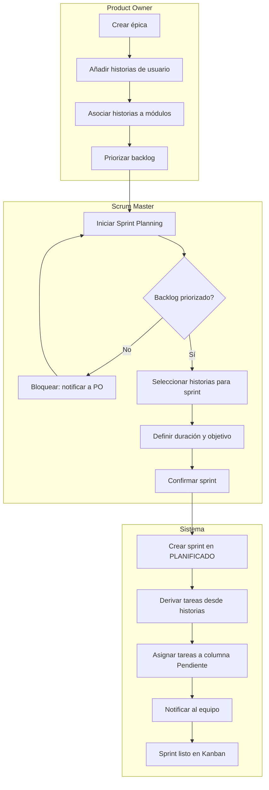

# Diagrama de Actividad — Flujo Backlog a Kanban

```mermaid
flowchart TD
    subgraph PO[Product Owner]
        A[Crear épica] --> B[Añadir historias de usuario]
        B --> C[Asociar historias a módulos]
        C --> D[Priorizar backlog]
    end

    subgraph SM[Scrum Master]
        E[Iniciar Sprint Planning]
        E --> F{Backlog priorizado?}
        F -->|No| G[Bloquear: notificar a PO]
        G --> E
        F -->|Sí| H[Seleccionar historias para sprint]
        H --> I[Definir duración y objetivo]
        I --> J[Confirmar sprint]
    end

    subgraph SISTEMA[Sistema]
        K[Crear sprint en PLANIFICADO]
        K --> L[Derivar tareas desde historias]
        L --> M[Asignar tareas a columna Pendiente]
        M --> N[Notificar al equipo]
        N --> O[Sprint listo en Kanban]
    end

    D --> E
    J --> K
```
