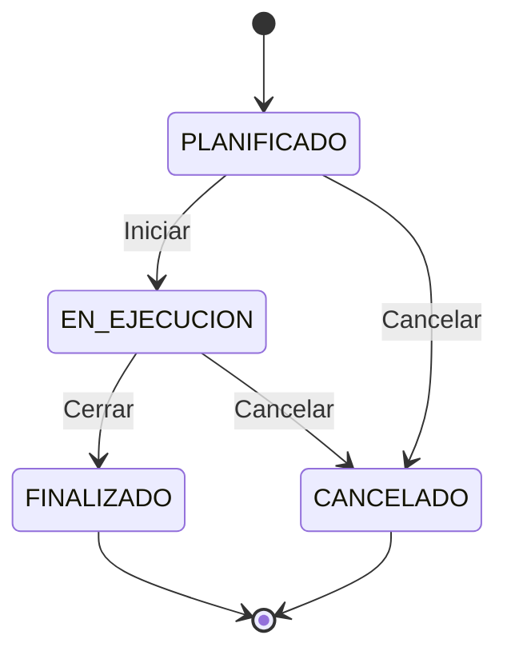

# Diagrama de Estado — Ciclo de Vida de Sprint

### Transiciones válidas

| Desde | Hacia | Condición | Actor |
|-------|-------|-----------|-------|
| PLANIFICADO | EN_EJECUCION | Sprint con tareas | SM |
| PLANIFICADO | CANCELADO | — | SM/PO |
| EN_EJECUCION | FINALIZADO | Todas las tareas terminadas o canceladas | SM |
| EN_EJECUCION | CANCELADO | Solo si no hay tareas en EN_PROCESO | SM/PO |
