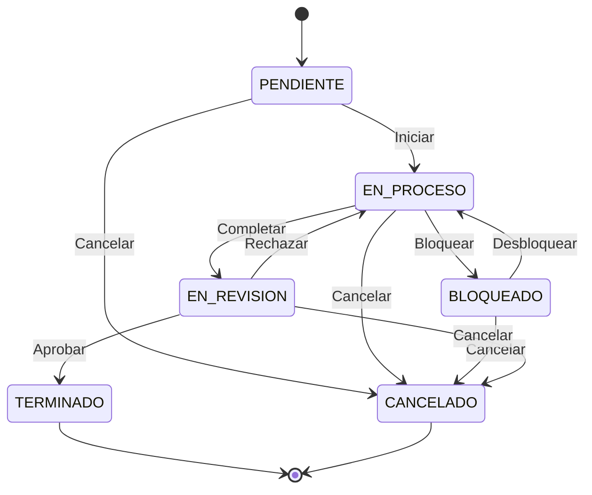

# Diagrama de Estado — Ciclo de Vida de Tarea



### Transiciones válidas

| Desde | Hacia | Condición | Actor |
|-------|-------|-----------|-------|
| PENDIENTE | EN_PROCESO | WIP < 3 | Developer |
| PENDIENTE | CANCELADO | — | SM/PO |
| EN_PROCESO | BLOQUEADO | — | Developer/SM |
| EN_PROCESO | EN_REVISION | — | Developer |
| EN_PROCESO | CANCELADO | — | SM/PO |
| BLOQUEADO | EN_PROCESO | WIP < 3 | Developer/SM |
| BLOQUEADO | CANCELADO | — | SM/PO |
| EN_REVISION | EN_PROCESO | WIP < 3 | Developer |
| EN_REVISION | TERMINADO | — | PO/SM |
| EN_REVISION | CANCELADO | — | SM/PO |


```