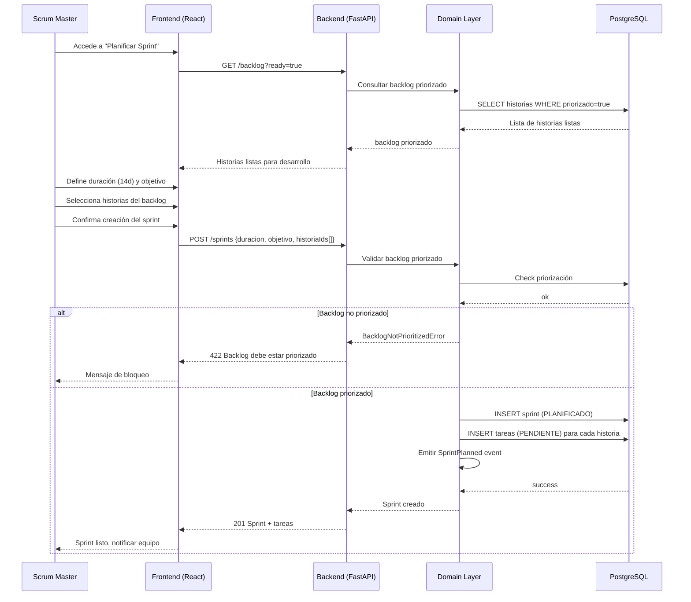

# Diagrama de Secuencia — Sprint Planning

```mermaid
sequenceDiagram
    participant SM as Scrum Master
    participant Frontend as Frontend (React)
    participant API as Backend (FastAPI)
    participant Domain as Domain Layer
    participant DB as PostgreSQL

    SM->>Frontend: Accede a "Planificar Sprint"
    Frontend->>API: GET /backlog?ready=true
    API->>Domain: Consultar backlog priorizado
    Domain->>DB: SELECT historias WHERE priorizado=true
    DB-->>Domain: Lista de historias listas
    Domain-->>API: backlog priorizado
    API-->>Frontend: Historias listas para desarrollo

    SM->>Frontend: Define duración (14d) y objetivo
    SM->>Frontend: Selecciona historias del backlog
    SM->>Frontend: Confirma creación del sprint

    Frontend->>API: POST /sprints {duracion, objetivo, historiaIds[]}

    API->>Domain: Validar backlog priorizado
    Domain->>DB: Check priorización
    DB-->>Domain: ok

    alt Backlog no priorizado
        Domain-->>API: BacklogNotPrioritizedError
        API-->>Frontend: 422 Backlog debe estar priorizado
        Frontend-->>SM: Mensaje de bloqueo
    else Backlog priorizado
        Domain->>DB: INSERT sprint (PLANIFICADO)
        Domain->>DB: INSERT tareas (PENDIENTE) para cada historia
        Domain->>Domain: Emitir SprintPlanned event
        DB-->>Domain: success
        Domain-->>API: Sprint creado
        API-->>Frontend: 201 Sprint + tareas
        Frontend-->>SM: Sprint listo, notificar equipo
    end
```
