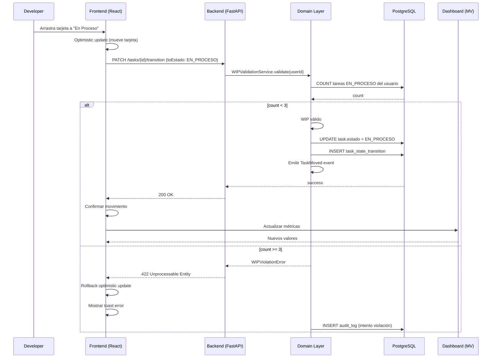

# Diagrama de Secuencia — Transición de Tarea Kanban

```mermaid
sequenceDiagram
    participant Developer
    participant Frontend as Frontend (React)
    participant API as Backend (FastAPI)
    participant Domain as Domain Layer
    participant DB as PostgreSQL
    participant Dashboard as Dashboard (MV)

    Developer->>Frontend: Arrastra tarjeta a "En Proceso"
    Frontend->>Frontend: Optimistic update (mueve tarjeta)
    Frontend->>API: PATCH /tasks/{id}/transition {toEstado: EN_PROCESO}

    API->>Domain: WIPValidationService.validate(userId)
    Domain->>DB: COUNT tareas EN_PROCESO del usuario
    DB-->>Domain: count

    alt count < 3
        Domain->>Domain: WIP válido
        Domain->>DB: UPDATE task.estado = EN_PROCESO
        Domain->>DB: INSERT task_state_transition
        Domain->>Domain: Emitir TaskMoved event
        DB-->>API: success
        API-->>Frontend: 200 OK
        Frontend->>Frontend: Confirmar movimiento
        Frontend->>Dashboard: Actualizar métricas
        Dashboard-->>Frontend: Nuevos valores
    else count >= 3
        Domain-->>API: WIPViolationError
        API-->>Frontend: 422 Unprocessable Entity
        Frontend->>Frontend: Rollback optimistic update
        Frontend->>Frontend: Mostrar toast error
        Domain->>DB: INSERT audit_log (intento violación)
    end
```
